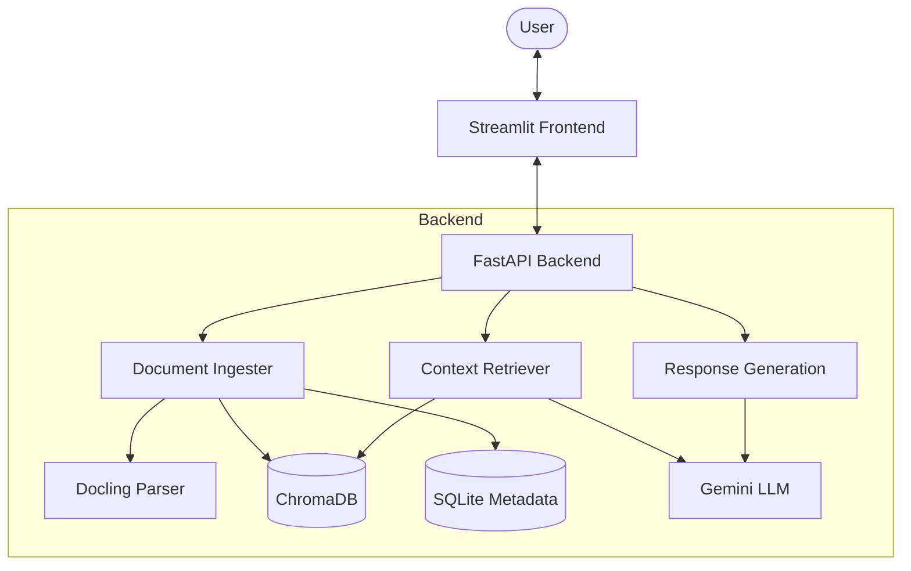

# 🧠 Knowledge Management RAG System

A powerful, local-first Retrieval-Augmented Generation (RAG) system designed to manage your personal knowledge base. Built with a modern client-server architecture, it allows you to upload documents, persist them in a vector database, and chat with your data using Google's Gemini models.


## ✨ Key Features

-   **📄 High-Fidelity Ingestion**: Powered by [Docling](https://github.com/DS4SD/docling) for advanced PDF, DOCX, and TXT parsing, including table recognition and layout analysis.
-   **🤖 Intelligent Retrieval**:
    -   **Multi-Query Expansion**: Uses Gemini to generate multiple perspectives of a user's question to improve retrieval accuracy.
    -   **Semantic Search**: Uses `sentence-transformers/all-MiniLM-L6-v2` embeddings stored in a local ChromaDB instance.
-   **💬 Context-Aware Chat**: Advanced chat interface powered by **Google Gemini 2.0 Flash Lite** with conversation history awareness.
-   **⚡ Asynchronous Processing**: Background document ingestion ensures the UI remains responsive even during large uploads.
-   **🛠️ Document Management**: Comprehensive interface to upload, view, search, and delete documents with real-time status tracking (`Uploaded` vs `Ingested`).
-   **🐳 Containerized**: Fully Dockerized for easy deployment and consistent environments.

## 🛠️ Architecture

The system is split into a **FastAPI backend** and a **Streamlit frontend**, ensuring a clean separation of concerns:



### Directory Structure
```
/
├── 📁 app/                 # FastAPI Backend
│   ├── main.py             # API Entry point & Dependency Injection
│   └── 📁 services/        # Core Business Logic
│       ├── document_ingester.py  # Docling + ChromaDB ingestion
│       ├── retriever.py          # Multi-query & Semantic Search
│       ├── generation.py         # Gemini LLM Interface
│       └── database.py           # SQLite state management
├── 📁 ui/                  # Streamlit Frontend
│   ├── Home.py             # Landing Page
│   └── 📁 pages/           # Chat & Document Management
├── 📁 data/                # Persistent Storage (Chroma, SQLite, Uploads)
├── Dockerfile              # Container definition
├── compose.yaml            # Multi-container orchestration
└── start.sh                # Unified startup script
```

## 🚀 Getting Started

### Prerequisites

-   Python 3.11 or higher
-   Docker (optional, for containerized run)
-   A [Google AI Studio](https://aistudio.google.com/) API Key

### Configuration

Create a `.env` file in the root directory:
```env
GOOGLE_API_KEY=your_google_api_key_here
GEMINI_MODEL=gemini-2.0-flash-lite
API_URL=http://localhost:8000/
DATA_DIR=data/
```

### Option 1: Running with Docker (Recommended)

The easiest way to get started is using Docker Compose:

```bash
docker-compose up --build
```
- **Backend API**: http://localhost:8000
- **Frontend UI**: http://localhost:7860

### Option 2: Local Installation

1.  **Clone the repository**
    ```bash
    git clone https://github.com/logan-codes/Knowledge-Management-with-RAG.git
    cd Knowledge-Management-with-RAG
    ```

2.  **Create and activate a virtual environment**
    ```bash
    python -m venv .venv
    # Windows
    .venv\Scripts\activate
    ```

3.  **Install dependencies**
    ```bash
    pip install -r requirements.txt
    ```

4.  **Run the application**
    You can use the provided script (Linux/WSL) or run manually:
    
    **Terminal 1 (Backend):**
    ```bash
    uvicorn app.main:app --host 0.0.0.0 --port 8000
    ```
    
    **Terminal 2 (Frontend):**
    ```bash
    streamlit run ui/Home.py --server.port 7860
    ```

## 📚 Usage Guide

1.  **Upload Info**: Navigate to **Document Management**. Upload your files.
2.  **Monitor Ingestion**: The system will process files in the background. Wait for the status to change to `✅ Ingested`.
3.  **Chat**: Switch to the **Chat Interface** and interact with your knowledge base. The system uses "Query Expansion" to find the most relevant context across all your documents.

## 🔮 Roadmap

-   [x] Docker & Docker Compose support
-   [x] High-fidelity parsing with Docling
-   [ ] Multiple chat sessions / Persistent chat history
-   [ ] UI support for source citations (Backend ready)
-   [ ] Support for local LLMs (Ollama/LM Studio)

---
*Built with ❤️ by [logan](https://github.com/logan-codes)*
